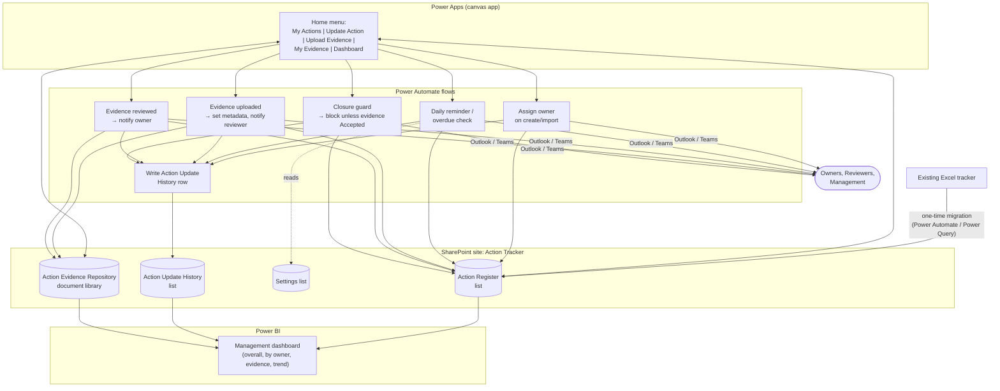
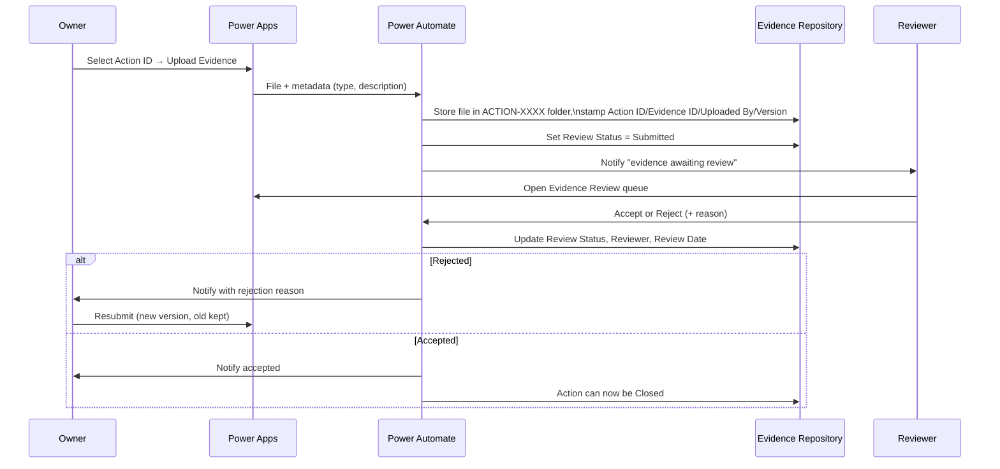

# Automated Action Management & Evidence Tracker — Design
### SharePoint / Power Platform architecture (primary, recommended solution)

## 0. How to read this document

This is the finalised architecture: **SharePoint is the system of record** for
both action data and evidence files, **Power Apps** is the user interface,
**Power Automate** drives every automation and audit-trail write, and
**Power BI** is the management dashboard. Nothing here needs new
infrastructure — it all runs inside the Microsoft 365 tenant the organisation
already has.

Because this session builds inside a git code repository rather than an M365
tenant, a live SharePoint site/Power Apps app/Power Automate flow can't be
provisioned or clicked through from here. So alongside this design, the repo
also ships a **working prototype** (`action_tracker/`, a small Flask web app)
that implements the *same* entities, IDs, and rules end-to-end, so you have
something to run and test today. §13 maps every prototype piece to its
SharePoint/Power Platform equivalent 1:1, so it can be rebuilt there directly.

## 1. Architecture diagram



Every box already exists as a Microsoft 365 service — there is nothing new to
host, patch, or back up.

## 2. SharePoint Lists required

One SharePoint site ("Action Tracker") containing:

| List | Purpose | Row = |
|---|---|---|
| **Action Register** | The master register (§4 has full columns) | one Action |
| **Action Update History** | Full change trail, insert-only | one update event |
| **Settings** | Configurable values (reminder days, etc.) | one key/value pair |

Evidence **metadata lives on the document library itself** (see §3) rather
than in a separate list — see the reasoning below.

## 3. SharePoint Document Library structure — folders vs. metadata

**Folder-per-Action-ID vs. flat library with metadata: the trade-off**

| | Folder per Action ID (your diagram) | Flat library, metadata only |
|---|---|---|
| Pros | Intuitive to browse in SharePoint/Teams/Explorer; auditors can open one folder and see everything; trivial "download all evidence for this action" | Scales cleanly to thousands of actions; no risk of the folder being renamed/moved and silently breaking the link to its Action; filtered/grouped views and search work at least as well, often better; simpler permission model (no per-folder unique permissions to manage) |
| Cons | At scale, unique permissions per folder get expensive to administer and SharePoint nags about "broken permission inheritance"; the *folder path* can become an unintended second source of truth if anyone moves a file | Less immediately browsable for someone used to Windows Explorer-style folders |

**Recommendation: do both, but make metadata the source of truth.**
Automatically create one folder per Action ID (`ACTION-0001`, `ACTION-0002`,
…) via Power Automate the moment an action is created — this gives you
exactly the browsable structure in your diagram, and nobody ever creates or
names a folder by hand. But every file also carries the metadata columns
below, and it is **those columns — never the folder path — that the Action
Register, Power Automate flows, and Power BI use** to know which action a
piece of evidence belongs to. That way you get the familiar folder view for
humans, while the system itself never breaks if a file gets moved, renamed,
or the folder structure is reorganised later.

```
Action Evidence Repository  (document library, versioning: ON)
│
├── ACTION-0001/
│   ├── Evidence 01 - Firewall_Review.xlsx      [metadata: Action ID=ACTION-0001, Evidence ID=EVD-0001, Status=Accepted, v1]
│   └── Evidence 02 - Review_Screenshot.pdf      [metadata: Action ID=ACTION-0001, Evidence ID=EVD-0002, Status=Submitted, v1]
├── ACTION-0002/
│   └── Evidence 01 - Access_List_Signoff.pdf
└── …
```

A rejected-then-resubmitted file becomes a **new version of the same library
item** (SharePoint's native version history keeps every prior version,
reviewer, and comment — nothing is ever deleted), so the "Version" metadata
column and SharePoint's built-in versioning stay in lock-step.

**Evidence metadata columns** (added to the library, not a separate list):
Action ID (lookup to Action Register), Evidence ID (auto, `EVD-0001…`),
Action Title (rollup, read-only), Evidence Type, Description, Uploaded By
(Person), Upload Date, Version, Review Status (Submitted / Under Review /
Accepted / Rejected), Reviewer (Person), Review Date, Rejection Reason,
Related Action (same lookup, shown here to match your spec — one physical
column, exposed as both "Action ID" and "Related Action" in views).

## 4. Action Register — columns and data types

| Column | Type | Notes |
|---|---|---|
| Action ID | Single line text, indexed, enforced unique | `ACTION-0001…`, set by flow on create, never editable |
| Title | Single line text | required |
| Description | Multiple lines of text | |
| Owner | **Person or Group** | drives Power Apps "My Actions" filter and permissions |
| Department / Function | Choice | |
| Priority | Choice: Low / Medium / High / Critical | |
| Source / Assessment | Choice or text | e.g. Internal Audit, Pen Test, ISO 27001 |
| Date Raised | Date only | |
| Original Target Date | Date only | set once, never overwritten |
| Current Target Date | Date only | owner-editable; every change logged to Update History |
| Status | Choice: Not Started / In Progress / Pending Validation / Completed / Overdue / Closed | |
| Completion % | Number (0–100) | |
| Latest Comment | Multiple lines of text | mirrors the newest Update History row |
| Last Updated | Date and time | set automatically by every flow, never by a user |
| Days Open | **Calculated column** (or Power BI measure) | `TODAY() - [Date Raised]` |
| Days Overdue | **Calculated column** (or Power BI measure) | `MAX(0, TODAY() - [Current Target Date])`, `0` once Closed/Completed |
| Evidence Required | Yes/No | |
| Evidence Status | Choice: Not Submitted / Submitted / Under Review / Accepted / Rejected | rolled up from the evidence library by flow |
| Evidence Link | Hyperlink | link to the action's folder in the Evidence Repository |
| Closure Date | Date only | set automatically when Status → Closed |
| Legacy ID | Single line text | original Excel reference, preserved for migration traceability |

`Action Update History` mirrors §4 of the original spec exactly: Action ID
(lookup), Update Date, Updated By (Person, auto), Previous/New Status,
Previous/New Target Date, Comment, Evidence Submitted (Yes/No), Approval/
Validation Status. **Insert-only** — no update/delete permission is granted
to any role on this list, which is what makes it a trustworthy audit trail.

## 5. Power Apps screens

| Screen | Who | What it does |
|---|---|---|
| **Home** | everyone | tiles: My Actions · Update Action · Upload Evidence · My Evidence · Evidence Review (Reviewer/Admin only) · Dashboard |
| **My Actions** | Owner | gallery filtered `Owner = User().Email`, overdue rows highlighted |
| **Action Detail** | everyone with access | selecting an Action ID auto-populates the full card — exactly the `ACTION-0045` example in your brief: title, owner, status, target date, %, latest comment, evidence thumbnails, `[Update Action]` `[Upload Evidence]` `[View History]` buttons |
| **Update Action** | Owner/Admin | status, % complete, target date, mandatory comment; submit patches the Action Register item and triggers the history-logging flow — under 2 minutes |
| **Upload Evidence** | Owner/Admin | Action ID pre-filled from context; multi-file attachment control; type + description; submit triggers the upload flow |
| **My Evidence** | Owner | every evidence item they've submitted with its Review Status, and the rejection reason if any, with a one-tap "resubmit" |
| **Evidence Review** | Reviewer/Admin | queue of Submitted/Under Review items; Accept / Reject (reason mandatory) buttons |
| **Dashboard** | everyone (read-only for Management) | embedded Power BI tile (full report opens in Power BI) |
| **Settings** | Admin | reminder days, closure-override log |

Navigation is a single `Home` screen of large tiles, matching the requested
menu; every other screen is reached in one tap from there or from an Action
Detail card.

## 6. Power Automate flows

| # | Trigger | Action |
|---|---|---|
| F1 – Assign | New item in Action Register (manual create or migration) | create the Action's folder in the Evidence Repository; email/Teams-notify the Owner |
| F2 – Reminders/overdue | Scheduled, once daily | for each open action, if `Current Target Date - Today` ≤ configurable reminder window → email Owner; if past due → set Status = Overdue, email Owner; writes to Action Update History |
| F3 – Evidence submitted | File created/added in the Evidence Repository (via the Power Apps upload) | stamp Action ID, Evidence ID, Uploaded By, Upload Date, Version, Review Status = Submitted; set the Action's Evidence Status = Submitted; notify the Reviewer(s) |
| F4 – Evidence reviewed | Review Status column changed to Accepted/Rejected (Power Apps button, or a SharePoint column-changed trigger) | update the Action's Evidence Status; notify the Owner (with reason if rejected); log to Update History |
| F5 – Closure guard | Power Apps "Update Action" submit where new Status = Closed | check Evidence Status = Accepted (or Evidence Required = No); if not met, block the save and return an error to the app *unless* the user is in the Admin permission group and supplies an override reason, which is written to Update History and flagged for management review |
| F6 – History logging | Called by F1–F5 (Power Automate child flow) | writes one row to Action Update History with previous/new values — this is what makes every change auditable without anyone touching the register directly |
| F7 – Closed notification | Status changes to Closed | notify Owner + Management group |

All flows are configurable, not hard-coded: the reminder window lives in the
**Settings** list so an Admin can change it without editing a flow.

## 7. Evidence upload/review workflow



## 8. Permission model

Four SharePoint groups on the site, each mapped to a Microsoft 365/Entra ID
security group so membership is managed centrally:

| Group | Action Register | Action Update History | Evidence Repository | Power BI dashboard |
|---|---|---|---|---|
| **Action Owners** | Contribute, restricted to **"view/edit only items they created or are the Owner of"** (built-in SharePoint list advanced setting) | Read-only, same item-level restriction | Contribute, but only within their own Action's folder (unique permission granted automatically by F1 when the folder is created) | not applicable (they work in Power Apps) |
| **Reviewers** | Read | Read | Contribute (to set Review Status/Reviewer/Review Date) across all folders | not applicable |
| **Process Owner / Admin** | Full Control | Full Control (only role that can act on override-related items) | Full Control | Edit |
| **Management** | Read | Read | **No access** | Read (view only) |

Why this avoids over-exposing evidence: Management's job is oversight of
*progress*, not access to the underlying files, some of which may contain
sensitive configuration detail, credentials-adjacent screenshots, or personal
data. Management gets full visibility of status/dates/evidence-status
through the Action Register columns and the Power BI dashboard (which reads
list/library **metadata**, not file contents), but the document library
itself is not shared with the Management group at all. Owners are similarly
scoped to their own folder via unique permissions set by the flow, so one
owner can never browse another owner's evidence just because they're both in
the same "Action Owners" group. Item-level security on the Action Register
(the "view only items created by/assigned to the user" setting) gives the
same containment on the register itself, without needing per-item unique
permissions there (which doesn't scale well on a list with hundreds of
rows).

## 9. Excel migration process

1. **Landing step**: the existing Excel file is uploaded once to a
   `Migration Source` folder in the SharePoint site — the original file is
   never edited, only read.
2. A one-time **Power Automate flow** (Excel Online connector →
   `List rows present in a table`) reads every row and, for each one,
   creates an item in the **Action Register** list, mapping columns per the
   table below.
3. **Action ID** is generated by the flow (`"ACTION-" & text(ID, "0000")`),
   never taken from the Excel file — the original reference is preserved in
   `Legacy ID` instead, so nothing about the old tracker is lost or
   overwritten.
4. A migration summary (rows imported / defaulted / skipped, with reasons)
   is written back to a `Migration Log` so the admin can verify the import
   before decommissioning the spreadsheet.

**Column mapping**

| Excel column (typical) | → SharePoint field | Cleansing needed before/at migration |
|---|---|---|
| Ref No / ID | Legacy ID | keep as text, do not reuse as Action ID |
| Action / Title | Title | trim whitespace, required — rows with no title are skipped and logged |
| Description | Description | — |
| Owner | Owner (Person) | **must be resolved to an actual Entra ID account** — free-text names in Excel ("Ahmed", "A. Balushi") need a one-time lookup/mapping table before the People column can be set; unmatched names are flagged in the migration log rather than silently dropped |
| Dept / Function | Department | map free-text values onto the fixed Choice list; anything unrecognised defaults to "Unassigned" and is flagged |
| Priority | Priority | normalise variants ("Med", "medium", "2") onto Low/Medium/High/Critical |
| Source | Source / Assessment | — |
| Raised Date / Due Date | Date Raised / Current + Original Target Date | Excel serial dates must be converted to real dates (not left as numbers); blank due dates flagged |
| Status | Status | normalise free text ("Done", "Complete") onto the fixed Choice list; unrecognised values default to "Not Started" and are flagged |
| % Complete | Completion % | strip "%" signs, clamp to 0–100 |
| Comments | Latest Comment | also becomes the first Action Update History row so history isn't empty |
| Evidence Required | Evidence Required | blank defaults to "Yes" (safer default) |
| *(any evidence file references)* | not imported automatically | Excel attachments/hyperlinks to evidence are **not** carried over automatically — evidence must be re-uploaded through Upload Evidence so it gets proper metadata and review status; the Excel reference is kept in the Description for traceability during the transition |

Rows that fail validation are **not silently dropped** — they're imported
with defaults applied and both flagged in the migration log and visible in
the Action Register so nothing requires re-keying from scratch, only review.

## 10. Power BI dashboard design

Power BI connects directly to the **Action Register** list, the **Action
Update History** list, and the **Evidence Repository** metadata via the
SharePoint Online connector (or a Dataverse layer later, if the register
outgrows a list). One data model, three tables related by **Action ID**.

**Overall (KPI cards)**: Total Actions, Completed, In Progress, Not Started,
Overdue, Due Soon, Pending Validation, Evidence Pending, Evidence Rejected —
each a DAX measure over the Action Register, e.g.
`Overdue = CALCULATE(COUNTROWS(Actions), Actions[Days Overdue] > 0)`.

**By Owner** (matrix visual): Total / Completed / Open / Overdue per owner —
one row per Owner, using the same measures sliced by `Actions[Owner]`.

**Evidence** (card row, sourced from library metadata): Evidence Required,
Submitted, Accepted, Rejected, Pending Review.

**Trend** (line/area charts): Actions opened by month (`Date Raised`),
Actions completed by month (`Closure Date`), cumulative completion %, and an
overdue trend built from a snapshot table (Power Automate can append a daily
row of "actions overdue today" to a small history list, since SharePoint
lists don't retain historical KPI state on their own).

**Top 10 overdue** (table visual, sorted descending by Days Overdue): Action
ID, Action, Owner, Target Date, Days Overdue, Latest Comment, Evidence
Status — with a URL column to jump straight into the Power Apps Action
Detail screen for any row.

The report is embedded as a tile on the Power Apps Dashboard screen (so
owners/reviewers never have to leave the app) and also published to a Power
BI app for Management's read-only access.

## 11. End-to-end user journey

```
Excel tracker ──(one-time migration)──▶ Action Register (SharePoint)
                                             │
                          F1 creates folder, notifies Owner
                                             ▼
                    Owner opens Power Apps → Update Action
                       status / comment / % / target date
                                             │
                              F6 logs Action Update History
                                             │
                    Owner opens Upload Evidence (same app)
                                             ▼
                         F3 stores file + metadata in
                         Action Evidence Repository, Status=Submitted
                                             │
                              F3 notifies Reviewer
                                             ▼
                    Reviewer opens Evidence Review queue
                       Accept ──────────────┐
                       Reject → reason ─────┤
                                             ▼
                    F4 updates Evidence Status, notifies Owner
                    (rejected → Owner resubmits, new version kept)
                                             │
                    Owner sets Status = Closed in Update Action
                                             ▼
                    F5 checks Evidence Status = Accepted
                       (else blocks, or Admin overrides + logs reason)
                                             ▼
                    F7 notifies Owner + Management, Closure Date set
                                             │
                                             ▼
                    Power BI dashboard and Action Register
                    reflect the new state immediately — no Excel touched
```

Searching one Action ID at any point (Power Apps search box, or the
register/Power BI) surfaces the full chain: register entry → every update
in Action Update History → every evidence file and its review trail → and,
once closed, the closure date and (if applicable) the override reason.

## 12. Implementation steps

1. Create the SharePoint site and the three lists + one document library
   with the columns in §4/§3 (Site Designs/PnP provisioning script
   recommended for repeatability).
2. Build the Power Apps canvas app (§5 screens), connected to the lists and
   library.
3. Build the Power Automate flows F1–F7 (§6), and the Settings list values
   they read.
4. Configure the four permission groups and item-level security (§8).
5. Run the Excel migration (§9) into a **test** environment first; validate
   row counts and the migration log against the source spreadsheet.
6. Build the Power BI report (§10) against the same lists; publish to a
   workspace/app for Management.
7. Pilot with one department for 1–2 weeks; adjust reminder windows and
   Choice list values based on real usage.
8. Run the migration into **production**, cut owners over to Power Apps,
   and stop editing the Excel file (archive it, read-only, for reference).
9. Train Owners/Reviewers with the exact Action Detail screen walkthrough
   from §5 — the whole update flow is one screen, under 2 minutes.

## 13. Prototype-to-SharePoint mapping

The Flask prototype in this repo (`action_tracker/`) implements every
entity and rule above so it can be run and clicked through today. Nothing in
it is a placeholder — it's the same data model, just hosted on SQLite/Flask
instead of SharePoint/Power Platform:

| Design element | Prototype implementation |
|---|---|
| Action Register list | `actions` table (`action_tracker/db.py`) |
| Action Update History list | `update_history` table, insert-only |
| Evidence Repository + metadata | `evidence` table + files under `uploads/evidence/<Action ID>/` (folder-per-Action-ID, metadata is the DB row — same hybrid model as §3) |
| Settings list | `settings` table (reminder days) |
| Power Apps screens | Flask routes/templates: Home, My Actions, Update Action, Upload Evidence, Evidence Review, Dashboard, Register |
| Power Automate F1–F7 | `utils.notify()`, `utils.run_reminder_checks()`, and the flow logic inline in `routes/actions.py` / `routes/evidence.py` (closure guard, history logging, notifications) |
| Power BI dashboard | `routes/dashboard.py` + Chart.js on `/dashboard` |
| Migration flow | `routes/importer.py` (upload → auto-suggested column mapping → preview → confirm), original file preserved under `uploads/imports/` |
| SharePoint permission groups | role-based access via `utils.role_required()` / `login_required()`, session-based user picker standing in for Entra ID SSO |

Rebuilding this in SharePoint/Power Platform is therefore a direct port, not
a redesign — the prototype is the functional spec, already exercised.

## 14. Risks / limitations

- **Prototype auth is a role/name picker, not real SSO** — the SharePoint
  build uses Entra ID/SharePoint groups (§8) for real access control.
- **Owner resolution during migration** is the one migration step that needs
  a human pass — free-text names in Excel must be matched to real accounts
  before the Person column can be set (§9).
- **List vs. Dataverse**: SharePoint Lists are recommended for simplicity
  and zero extra licensing, and comfortably handle hundreds to low
  thousands of actions. If the register grows much larger or needs complex
  relational reporting, Dataverse is the natural next step with minimal
  rework (Power Apps/Automate/BI all support it the same way).
- **Power BI trend data**: SharePoint lists don't retain historical
  snapshots, so the overdue trend needs a small daily-snapshot flow (§10) —
  a known, standard pattern, not a blocker.
- **Closure override is powerful** — restricted to the Admin group and
  always logged with a mandatory reason (F5), but it's a control worth
  reviewing periodically (a Power BI filter on "override" rows in Update
  History gives Management that visibility for free).
